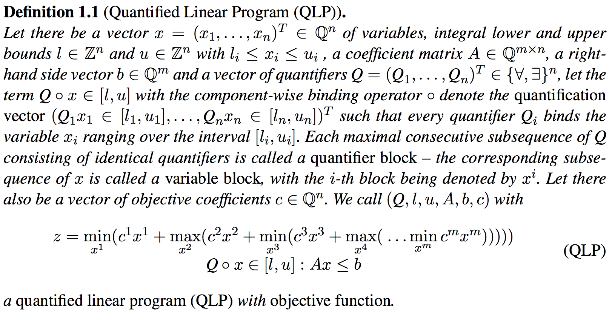
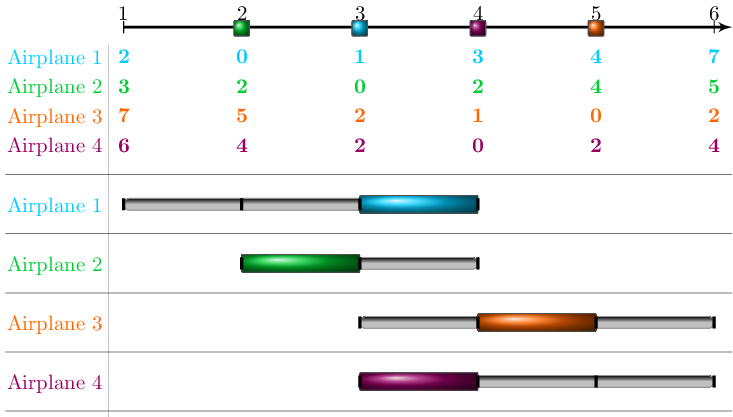
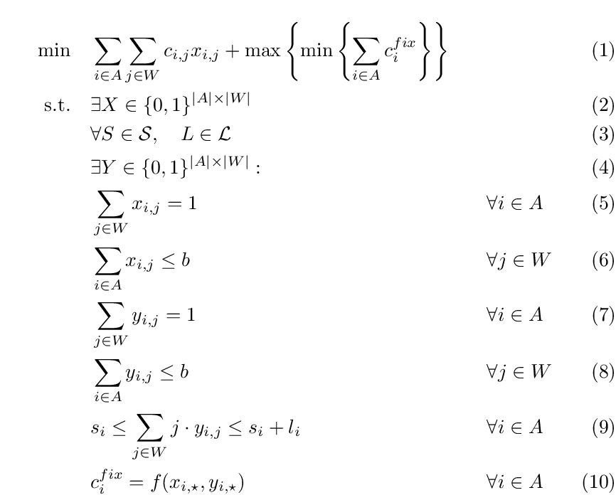
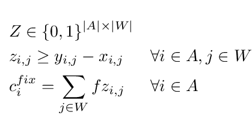
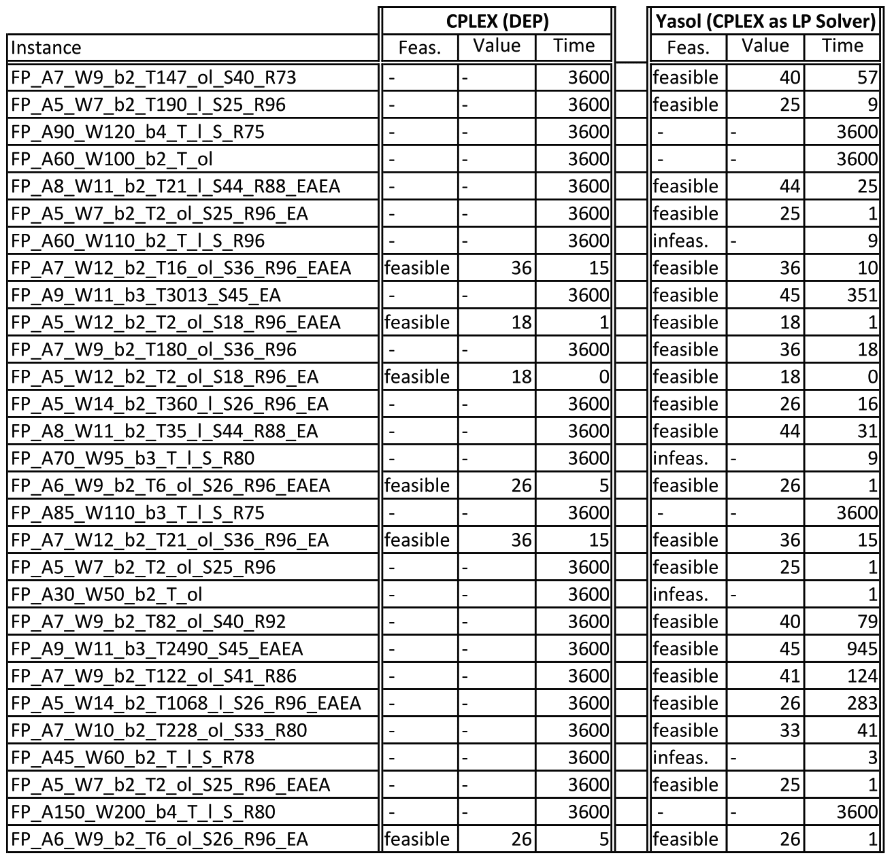

# Q-MIPs

### Quantified (Mixed) Integer Linear Programming

Mixed-integer linear programming (MIP) is a well-established state-of-the-art technique for computer-aided optimization. However, companies observe an increasing danger of disruptions that prevent them from acting as planned. One reason is that input data is often assumed to be deterministic, but in reality, they are afflicted with uncertainties which cannot be adequately described in MIPs, often. This is the point where Q-MIPs are intended to support future modeling.

In 2007, Subramani coined the terms Quantified Linear Program and Quantified Integer Program and thus extended the traditional notions of Linear and Integer Programming1. The resulting quantified programs are both a strong modelling language and an intuitive input to next generation optimization software.

We extended this notion one step further and introduced a minimax objective2:

... as well as a restricted mixed version with the following attributes:

* the objective is minmax (more exactly: min max min … max min max) and is linear for any single game
* integer variables are allowed on all exist-stages
* (only) binary variables are allowed on universal stages
* continuous variables are allowed (only) on the last stage, assuming it is an existential stage
* quantifiers are either existential or universal

1 K. Subramani: On a decision procedure for quantified linear programs. Ann. Math. Artif. Intell. 51(1): 55-77 (2007)  
2 U. Lorenz, J. Wolf: Solving Multistage Quantified Linear Optimization Problems with the Alph-beta nested Benders Decomposition, EURO Journal on Computational Optimization, pp. 349 - 370, Springer 2015

---

### A tiny Q-MIP

Let x1 and x3 be existential variables and x2 a universal variable. Thus we have, ∃x1 ∀x2 ∃x3. The aim is to find an optimal first stage setting for x1 such that the objective maxx1(x1 + minx2(x2 + maxx3(x3))) is optimized, and such that 

-2x2 -1x3 ≤ -2  
-1x1 +2x2 +1x3 ≤ 2  
 2x1 + 4x2 ≤ 6

0 ≤ x1 ≤ 2  
0 ≤ x2 ≤ 1  
0 ≤ x3 ≤ 2

Let x1 be integer, x2 binary, and x3 be continuous.

Then the objective value is 3 and the optimal assignment of  x1  is 1. Moreover, x3 should be set to either 0 or 2, depending on whether x2 becomes 1 or 0. It is possible to visualize the policy. In the following picture, you see an outer 3d-polytope which is caught in a box. That is the polytope which is generated by the existential LP-relaxation, i.e. all variables are assumed to be existential and continuous. Within the given polytope you see another one, in light red. That is the union of all 3D-points that are part of any feasible policy of the existential player, given the original ∃∀∃ quantifier string. You can also see that x1 can be set between 0 and 1 (i.e. half of the box in x1-direction) and depending on how x2 is set (either 0 or 1), x3 can be moved up to its upper bound 2 or must smaller or equal to 1.

You can download the QLP file for this instance. For a closer look at the file format see this page.

---

### A universal constraint system: Allowing polyhedral and decision-dependent uncertainty

A QIP is inherently asymmetric, as even though the min-max semantic of the objective is symmetric, the universally quantified variables are only restricted to their domain (solely given by bounds), whereas the existential player—in addition to having to obey the variable bounds—also must ensure the fulfillment of the constraint system. In other words: only the existential player has to cope with a polytope influenced by the opponent’s decisions whereby a polyhedral, or even decision-dependent, uncertainty set can only be modeled via tricky and not straight-forward modeling techniques. In order to be able to model the uncertainty set in a more simple way a second constraint system A∀x ≤ b∀ was introduced, which allowed to explicitly model a polyhedral uncertainty set1. The usage of this universal constraint system was later extended to even allow decision-dependent uncertainty set2. For both modeling frameworks we also extended our solution framework3.

**Example**  
We consider a binary quantified program with an existential and a universal constraint system. As existentially quantified variables (x1 and x2) have non-zero entries in the universal constraint system this instance is a QIP with decision-dependent uncertainty called QIP with interdependent domains. In particular, if both x1 and x2 are set to 1 the universal variable must not be 1. However, the existential player also has to ensure that setting x1 and x2 to 1 will no render the existential constraint system violated. As this is not the case, x1=1 and x2=1 is a legal variable assignment. In this case setting x3=1 would be an illegal assignment by the universal player, as it irrevocably violated the universal constraint system.

Policy Space?

The optimal solution of this instance is -1 with principal variation (1,1,0,0). In order to solve this instance with our solver, a universal constraint must be explicitly named in the QLP file using the keyword UNCERTAINTY SUBJECT TO [Download instance].

MINIMIZE  
x1 -2x2 +2x3 +x4  
SUBJECT TO  
x1 -2x2 +x3 -x4 <= 1  
x1 +x2 +x3 -x4 <= 2  
UNCERTAINTY SUBJECT TO  
x1 +x2 +x3 <= 2  
BOUNDS  
0 <= x1 <= 1  
0 <= x2 <= 1  
0 <= x3 <= 1  
0 <= x4 <= 1  
BINARIES  
x1 x2 x3 x4  
EXISTS  
x1 x2 x4  
ALL  
x3  
ORDER  
x1 x2 x3 x4  
END  

**Simply Restricted Instances**  
In order to ensure that universal variable assignments are legal, i.e. that they do not eventually result in a violation of the universal constraint system, the feasibility of the universal constraint system must be checked in each step. This can be tedious as this means solving an IP at each universal decision node. However, we observed the following in many multistage robust problems:

* Uncertainty maybe can be manipulated, but it cannot be 'defeated' in the sense that no legal move remains.
* Potential realizations of uncertain parameters are easily recognizable, i.e. classifying a universal variable assignment as legal or illegal should not be an NP-complete problem.

We formalized this observation and we call instances those observations apply to simply restricted.

Definition Simply Restricted?

The benefit of having a simply restricted instance is that then the legality of a universal variable assignment can be checked be simply traversing the universal constraints and checking whether they remain satisfiable, even in the worst case. Thus, the satisfiability of entire universal constraint system can be checked locally rather than solving the entire IP. If your instance is simply restricted you can specify "isSimplyRestricted=1" in the Yasol.ini file. If your instance does not fulfill the requirements, or if you are not sure, simply set "isSimplyRestricted" to zero, and each universal variable assignment will be verified by solving the corresponding universal IP. 

1 M. Hartisch, T. Ederer, U. Lorenz, J. Wolf. Quantified Integer Programs with Polyhedral Uncertainty Set. In: A. Plaat, W. Kosters, J. van den Herik (eds) Computers and Games. CG 2016. Lecture Notes in Computer Science, vol 10068. Springer, Cham, 2016

2 M. Hartisch, U. Lorenz. Mastering uncertainty: Towards robust multistage optimization with decision dependent uncertainty. In 16th Pacific Rim International Conference on Artificial Intelligence, PRICAI 2019, Seiten 446–458. Springer, 2019

3 M. Hartisch. Quantified Integer Programming with Polyhedral and Decision-Dependent Uncertainty. PhD thesis, University of Siegen, Germany, 2020

---

### Quantified Programs applied to Runway Scheduling

The following QIP problem definition and, as a consequence the content of this page, is a result of cooperative work between University Siegen (S. Gnad, M. Hartisch, U. Lorenz) and FAU Erlangen (L. Hupp, F. Liers, A. Peter). We used QIPs to model and solve a matching problem that can be interpreted as an airplane scheduling problem in which each airplane must be assigned to a time slot and at most b airplanes can be assigned to one time slot. This b-matching is enhanced by uncertain time intervals in which an airplane must land. For reasons of simplicity we will use the airplane scheduling interpretation to explain our intentions.

Figure 1: Example with 4 airplanes and 6 possible time slots. 2 airplanes can be scheduled at each time slot (b=2). The initial planning costs are given and the possible time windows (consisting of two time slots) for each airplane are depicted as sliders below.

Broadly speaking, we are interested in an initial plan that can be fixed cheaply if the mandatory time windows (the sliders in the figure) for some planes do not contain the initially scheduled time slot. Reasons for such variations (in the arrival time) might be adjusted airspeed (due to weather) or operational problems. 

The incurred costs are composed of the costs for the initial plan and the fixing costs. The costs for the initial plan only depend on the the initial assignment of planes to time slots regarding predetermined costs: In the example above assigning airplane 2 to time slot 4 would result in costs of 2 monetary units.

There are some ideas for the composition of the fixing costs, for example:

* rescheduling one airplane results in a fixed fee 
* rescheduling one airplane results in costs depending on the newly selected time slot
* rescheduling one airplane results in costs depending on the initial and the newly selected time slot

For simplicity and a more general presentation, the costs of replacing airplane i depend on a function f(xi\*,yi\*) representing the relation between initial plan, fixed plan and fixing costs. Depending on the selected cost type, this function can be modeled using linear constraints.

**Basic quantified program for the airplane runway scheduling problem:**

Brief explanation of the model:

1. three stage objective function
    * first stage: select initial plan resulting in initial costs
    * second stage: uncertain events → new conditions regarding allowed time slots (the start (si∈S) and the length (li∈L) of the time window is selected for each airplane i)
    * third stage: if necessary fix the initial plan causing additional costs
2. First stage existential variables: Initial scheduling variables
3. Second stage universal variables: Specification of the starting point (s) and the length (l) of the mandatory time window for each airplane
4. Third stage existential variables: Final scheduling variables respecting the time windows defined in stage two 
5. Ensures that each airplane is assigned to exactly one time slot in the initial plan
6. Ensures that each time slot can only hold b airplanes in the initial plan 
7. Ensures that each airplane is assigned to exactly one time slot in the fixed plan
8. Ensures that each time slot can only hold b airplanes in the fixed plan 
9. Binds the assigned time slots of the fixed plan to the given time window
10. Fixing costs depend on difference between initial plan (X) and fixed plan (Y); various cost models imaginable.

**Example costs: fixed fee**  
If, for example, the first mentioned fixing costs were used, i.e. fixed fee for replanning, further existential variables Z∈{0,1}|A|×|W| are installed in the third stage and the following constraints would be added:

In this case variable zij must identify if airplane i was not scheduled in time slot j in the initial plan but in the fixed plan resulting in costs f for this plane.

**Restricting the universal variables**  
By choosing the domains of the universal variables S and L carefully the user already can limit the influence of the universal variables. Nevertheless, some scenarios should not be considered: For example one might want to allow the time windows for some airplane to consist of only one time slot. However, this should not be the case for all airplanes, since this would constitute a rather implausible event. One conceivable demand for the time windows could be that on average the time windows have a length of 2 (i.e. consist of two time slots). Thus, the universal variables L should not only be forced to lie within some bounds, but also within a specific polytope. The polytope for this example would require the following additional constraint:

However, simply adding this constraint to the constraint system would not have the desired effect. In fact, it would increase the influence of the universal variables since this constraint could easily be violated and thus the entire instance would become infeasible. However, adding this as a universal constraint would do the trick. or the enforcement of rules regarding the universal variables could be performed implicitly: In a final existential block the fulfillment of such a constraint is checked and if a violation is detected the remaining constraint system is relaxed and the objective value is reduced dramatically. This has the effect that a violation provoked by the allocation of universal variables results in a very good objective value (regarding the existential objective of minimization) and is thus unfavorable with respect to the universal maximization objective.

**Instances**  
For this runway scheduling problem we created several instances with several variations:

* Instances with more than 3 stages: After the initial plan the time windows for some airplanes are selected by the universal variables. For these airplanes a fixed plan must be prepared. After that the time windows for the remaining airplanes are specified by the universal variables and once again the plan must be fixed. 
* Instances with restricted universal variables: As explained above, the universal variables determining the interval lengths must obey some rules.
* Instances with different objective function: the first (fixed fee) and third (distance from initial and final time slot) presented fixing costs are considered.
* Instances with diverse time windows: The interval length can vary from 0 up to 4 time slots and the interval itself can start at up to 4 time slots.
* Instances with different numbers of airplanes and time slots: the number of airplanes varies between 5 and up to more than 100. The number of time slots varies between 7 and up to 200 time slots.

Download Instances

For each of these 29 instances our solver Yasol (utilizing the Cplex LP solver) had one hour to solve the instance. The results where compared to Cplex trying to solve the corresponding deterministic equivalent program, also within one hour. The results are displayed in the following table. Yasol solves 25 out of the 29 instances while CPLEX only can solve 6 of the converted DEPs. Even when only considering the instances solved by CPLEX, Yasol only needs 2.66 seconds on average compared to 6.83 seconds. If instances get large (easy indicator is the number right after the 'A' in the instance name) Yasol is able to detect infeasible instances rather fast but does not manage to grasp optimal feasible solutions. CPLEX, on the other hand, often exceeds the available memory on such instances and does not cope very well if many universal variables are present. But even on instances with few universal variables CPLEX quickly reaches its limit.

1 Hartisch M., Ederer T., Lorenz U., Wolf J. (2016) Quantified Integer Programs with Polyhedral Uncertainty Set. In: Plaat A., Kosters W., van den Herik J. (eds) Computers and Games. CG 2016. Lecture Notes in Computer Science, vol 10068. Springer, Cham